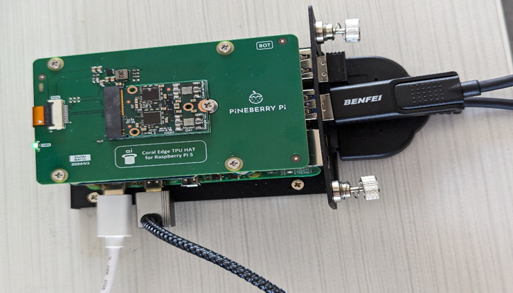
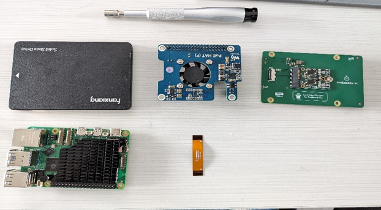
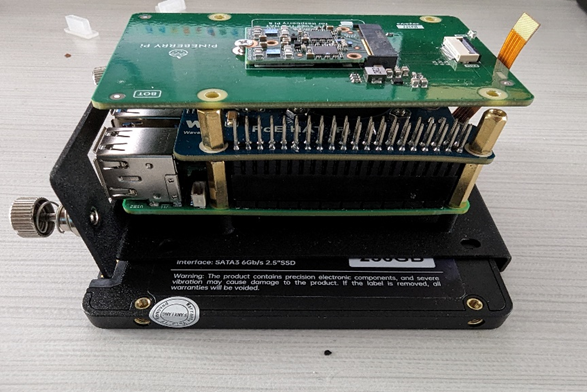
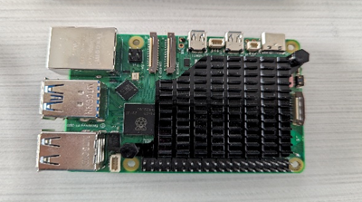
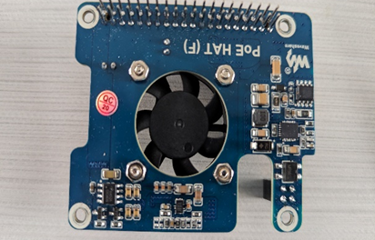
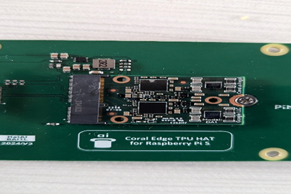

# Configure Raspberry Pi 5 with Coral TPU and POE HAT

**Date**: May 2024 - June 1st

## Overview

This guide will help you set up a Raspberry Pi 5 with a Google Coral TPU and a POE HAT for Power over Ethernet (PoE) functionality.

## Hardware Requirements

### Raspberry Pi 5
- 2.4GHz quad-core 64-bit Arm Cortex-A76 CPU
- Dual 4Kp60 HDMI® display output
- 4Kp60 HEVC decoder
- Dual-band 802.11ac Wi-Fi®, Bluetooth 5.0 / Bluetooth Low Energy (BLE)
- High-speed microSD card interface with SDR104 mode support
- 2 × USB 3.0 ports, supporting simultaneous 5Gbps operation
- 2 × USB 2.0 ports
- Gigabit Ethernet, with PoE+ support

### Coral TPU
- Compatibility: Supports the Coral TPU in M.2 format with an E-key interface.
- PCIe x1 Interface Support: Maintains compatibility with PCIe x1 interface, supporting both Gen2 and Gen3 standards.

### Additional Hardware
- SSD 256GB
- POE HAT
- Coral TPU HAT

## Review

### Hardware





1. [Raspberry Pi 5](https://www.waveshare.com/wiki/Raspberry_Pi_5)
   - Improved performance with upgraded CPU, GPU, and memory.
   - Accelerates machine learning inference tasks on edge devices.
   - Enhances efficiency and versatility in AI and IoT applications.
   - Performs machine learning tasks with high energy efficiency.
   - Ideal for deployment in resource-constrained environments.
   - Simplifies development with access to pre-trained models and tools.
   - Compatible with TensorFlow Lite framework for easy integration.



2. [POE HAT](https://www.waveshare.com/poe-hat-f.htm)
   - Provides power over Ethernet.
   - Includes a cooling system with a metal heatsink.
   - Supports 802.3af/at network standard.



3. [Coral TPU HAT](https://pineboards.io/products/hat-ai-coral-edge-tpu-bundle-for-raspberry-pi-5)
   - Google Coral Edge TPU designed for Raspberry Pi 5.
   - Coral TPU in M.2 format with E-key interface.
   - PCIe x1 interface support, integrable with Raspberry Pi 5 using PCI FPC.

## Prerequisites
- Basic Linux commands
- Raspberry Pi 5 with RPi desktop / no desktop OS
- All the hardware mentioned above
## Configuration Steps

1. **Configure Hardware Settings:**
    - Edit the Raspberry Pi configuration file:
      ```bash
      sudo nano /boot/firmware/config.txt
      ```
    - Add the following lines:
      ```bash
      [all]
      # Enable the PCIe External connector.
      dtparam=pciex1
      kernel=kernel8.img
      # Enable Pineboards Hat Ai
      dtoverlay=pineboards-hat-ai
      ```
    - Save and close the file, then reboot your Raspberry Pi:
      ```bash
      sudo reboot
      ```

2. **Update Raspberry Pi Kernel and Install Kernel Headers:**
    - Update the system:
      ```bash
      sudo apt update
      sudo apt full-upgrade
      ```
    - Install rpi-update:
      ```bash
      sudo apt install rpi-update
      ```
    - Update the kernel:
      ```bash
      sudo rpi-update
      ```
    - Reboot your Raspberry Pi:
      ```bash
      sudo reboot
      ```
    - Install rpi-source to fetch kernel headers:
      ```bash
      sudo apt install git bc bison flex libssl-dev make libncurses5-dev
      sudo wget https://raw.githubusercontent.com/jgartrel/rpi-source/master/rpi-source -O /usr/bin/rpi-source
      sudo chmod +x /usr/bin/rpi-source
      rpi-source --tag-update
      ```
    - Fetch the kernel headers:
      ```bash
      rpi-source --default-config
      uname -a
      ```
      Expected output:
      ```
      Linux coralpi 6.6.30-v8+ #1761 SMP PREEMPT Thu May  2 16:54:52 BST 2024 aarch64 GNU/Linux
      ```

3. **Install PCIe Driver and Edge TPU Runtime:**
    ```bash
    sudo apt update
    echo "deb https://packages.cloud.google.com/apt coral-edgetpu-stable main" | sudo tee /etc/apt/sources.list.d/coral-edgetpu.list
    curl https://packages.cloud.google.com/apt/doc/apt-key.gpg | sudo apt-key add -
    sudo apt-get update
    curl -sS https://packages.cloud.google.com/apt/doc/apt-key.gpg | gpg --dearmor | sudo tee /usr/share/keyrings/google.gpg
    echo "deb [signed-by=/usr/share/keyrings/google.gpg] https://packages.cloud.google.com/apt coral-edgetpu-stable main" | sudo tee /etc/apt/sources.list.d/coral-edgetpu.list
    sudo apt-get update
    sudo apt-get install cmake libedgetpu1-std devscripts debhelper dkms dh-dkms
    ```

4. **Install Gasket Driver:**
    ```bash
    git clone https://github.com/google/gasket-driver.git
    cd gasket-driver
    sudo debuild -us -uc -tc -b
    cd ..
    sudo dpkg -i gasket-dkms_1.0-18_all.deb
    ```

5. **Set Up udev Rule:**
    ```bash
    sudo sh -c "echo 'SUBSYSTEM==\"apex\", MODE=\"0660\", GROUP=\"apex\"' >> /etc/udev/rules.d/65-apex.rules"
    sudo groupadd apex
    sudo adduser $USER apex
    sudo reboot
    ```

6. **Verify Driver and Device:**
    - After rebooting, verify if the driver is loaded and the device is detected:
      ```bash
      sudo lspci -v
      ls /dev/apex_0
      ```

7. **Install Docker:**
    ```bash
    sudo apt install ca-certificates curl gnupg
    sudo install -m 0755 -d /etc/apt/keyrings
    curl -fsSL https://download.docker.com/linux/debian/gpg | sudo gpg --dearmor -o /etc/apt/keyrings/docker.gpg
    sudo chmod a+r /etc/apt/keyrings/docker.gpg
    echo "deb [arch=\"\$(dpkg --print-architecture)\" signed-by=/etc/apt/keyrings/docker.gpg] https://download.docker.com/linux/debian \$(. /etc/os-release && echo \"\$VERSION_CODENAME\") stable" | sudo tee /etc/apt/sources.list.d/docker.list > /dev/null
    sudo apt update
    sudo apt install docker-ce docker-ce-cli containerd.io docker-buildx-plugin docker-compose-plugin
    ```

8. **Build a Docker Image for Coral Testing:**
    - Create a Dockerfile:
      ```Dockerfile
      FROM debian:10

      WORKDIR /home
      ENV HOME /home

      RUN cd ~ \
          && apt-get update \
          && apt-get install -y git nano python3-pip python-dev pkg-config wget usbutils curl \
          && echo "deb https://packages.cloud.google.com/apt coral-edgetpu-stable main" | tee /etc/apt/sources.list.d/coral-edgetpu.list \
          && curl https://packages.cloud.google.com/apt/doc/apt-key.gpg | apt-key add - \
          && apt-get update \
          && apt-get install -y edgetpu-examples
      ```
    - Build the Docker image:
      ```bash
      sudo docker build -t "coral" .
      ```
    - Run the Docker image:
      ```bash
      sudo docker run -it --device /dev/apex_0:/dev/apex_0 coral /bin/bash
      ```
    - In the container, run an Edge TPU example:
      ```bash
      python3 /usr/share/edgetpu/examples/classify_image.py --model /usr/share/edgetpu/examples/models/mobilenet_v2_1.0_224_inat_bird_quant_edgetpu.tflite --label /usr/share/edgetpu/examples/models/inat_bird_labels.txt --image /usr/share/edgetpu/examples/images/bird.bmp
      ```

    This should output classification results.
    
    root@7bb44c28f378:~# python3 /usr/share/edgetpu/examples/classify_image.py --model /usr/share/edgetpu/examples/models/mobilenet_v2_1.0_224_inat_bird_quant_edgetpu.tflite --label /usr/share/edgetpu/examples/models/inat_bird_labels.txt --image /usr/share/edgetpu/examples/images/bird.bmp

    ---------------------------
    
    Poecile atricapillus (Black-capped Chickadee)
    Score :  0.44140625
    
    ---------------------------
    
    Poecile carolinensis (Carolina Chickadee)
    Score :  0.29296875
